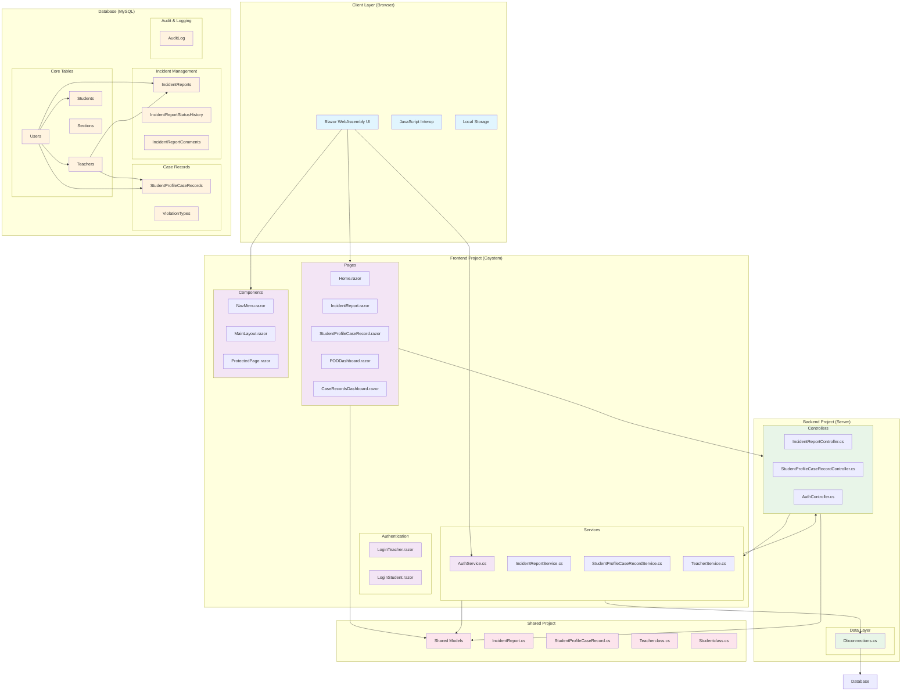

# Gsystem - System Architecture Documentation

## Overview
Gsystem is a comprehensive school management system built with .NET 8 Blazor WebAssembly for incident reporting and student case record management. The system follows a client-server architecture with separate projects for the frontend (Blazor WebAssembly) and backend (ASP.NET Core Web API).

## System Architecture Diagram



## Architecture Components

### 1. Frontend Layer (Blazor WebAssembly)

#### **Pages**
- **Home.razor**: Landing page with navigation
- **IncidentReport.razor**: Anonymous incident reporting form
- **StudentProfileCaseRecord.razor**: Student case record management
- **PODDashboard.razor**: Person of Designation dashboard
- **CaseRecordsDashboard.razor**: Case records overview

#### **Components**
- **NavMenu.razor**: Navigation menu component
- **MainLayout.razor**: Main application layout
- **ProtectedPage.razor**: Authentication wrapper component

#### **Services**
- **AuthService.cs**: Client-side authentication management

#### **Authentication Pages**
- **LoginTeacher.razor**: Teacher login interface
- **LoginStudent.razor**: Student login interface

### 2. Backend Layer (ASP.NET Core Web API)

#### **Controllers**
- **IncidentReportController.cs**: Handles incident report CRUD operations
- **StudentProfileCaseRecordController.cs**: Manages student case records
- **AuthController.cs**: Authentication and authorization

#### **Services**
- **IncidentReportService.cs**: Business logic for incident reports
- **StudentProfileCaseRecordService.cs**: Business logic for case records
- **TeacherService.cs**: Teacher management operations

#### **Data Access**
- **Dbconnections.cs**: Database connection management

### 3. Shared Project
Contains shared data models and DTOs used by both frontend and backend:
- **IncidentReport.cs**: Incident report data models
- **StudentProfileCaseRecord.cs**: Case record data models
- **Teacherclass.cs**: Teacher data models
- **Studentclass.cs**: Student data models

### 4. Database Layer (MySQL)

#### **Core Tables**
- **Users**: User authentication and basic information
- **Teachers**: Teacher-specific information and roles
- **Students**: Student information and enrollment data
- **Sections**: Class sections and grade management

#### **Incident Management Tables**
- **IncidentReports**: Main incident report storage
- **IncidentReportStatusHistory**: Status change tracking
- **IncidentReportComments**: Comments and notes

#### **Case Records Tables**
- **StudentProfileCaseRecords**: Student disciplinary records
- **ViolationTypes**: Predefined violation categories

#### **Audit & Logging**
- **AuditLog**: System activity tracking

## Data Flow

### 1. Incident Reporting Flow
1. User accesses IncidentReport.razor
2. Form data is validated client-side
3. Data is sent to IncidentReportController via HTTP POST
4. Controller delegates to IncidentReportService
5. Service persists data to IncidentReports table
6. Response is returned to client

### 2. Case Record Management Flow
1. Authenticated user accesses StudentProfileCaseRecord.razor
2. AuthService validates user authentication
3. Form data is submitted to StudentProfileCaseRecordController
4. Controller validates and processes request
5. Service creates record in StudentProfileCaseRecords table
6. Success response returned to client

### 3. Authentication Flow
1. User attempts to access protected resources
2. AuthService checks localStorage for auth token
3. If not authenticated, redirect to login page
4. Login form submits credentials to AuthController
5. Controller validates credentials against Users table
6. JWT token generated and stored in localStorage
7. User is redirected to requested page

## Technology Stack

### Frontend
- **.NET 8 Blazor WebAssembly**
- **Bootstrap 5** for styling
- **Blazored.LocalStorage** for client-side storage
- **JavaScript Interop** for browser APIs

### Backend
- **.NET 8 ASP.NET Core Web API**
- **MySQL** database with MySql.Data connector
- **Entity Framework Core** (implied from data access patterns)
- **CORS** enabled for cross-origin requests

### Database
- **MySQL 8.0+**
- **Stored Procedures** for complex operations
- **Triggers** for audit logging
- **Views** for reporting

## Security Features

1. **Authentication**: Token-based authentication using localStorage
2. **Authorization**: Role-based access control (Teacher/Student)
3. **Data Validation**: Client and server-side validation
4. **Audit Logging**: Complete activity tracking
5. **CORS Configuration**: Secure cross-origin requests

## Deployment Architecture

```
Internet → Load Balancer → Web Server (IIS/Nginx)
                           ↓
                    Blazor WebAssembly (Static Files)
                           ↓
                    ASP.NET Core API (Kestrel)
                           ↓
                    MySQL Database
```

## Key Features

1. **Anonymous Incident Reporting**: Students can report incidents without authentication
2. **Case Record Management**: Teachers can create and manage student disciplinary records
3. **Teacher Search**: Dynamic teacher lookup with autocomplete
4. **Violation Management**: Configurable violation types and categories
5. **Status Tracking**: Incident report status workflow
6. **Audit Trail**: Complete system activity logging
7. **Responsive Design**: Mobile-friendly interface

## Scalability Considerations

1. **Database Indexing**: Optimized indexes on frequently queried columns
2. **Connection Pooling**: Efficient database connection management
3. **Caching**: Local storage for frequently accessed data
4. **Pagination**: Implemented for large data sets
5. **Async Operations**: Non-blocking database operations

This architecture provides a solid foundation for a school management system with room for future enhancements and scalability improvements.
