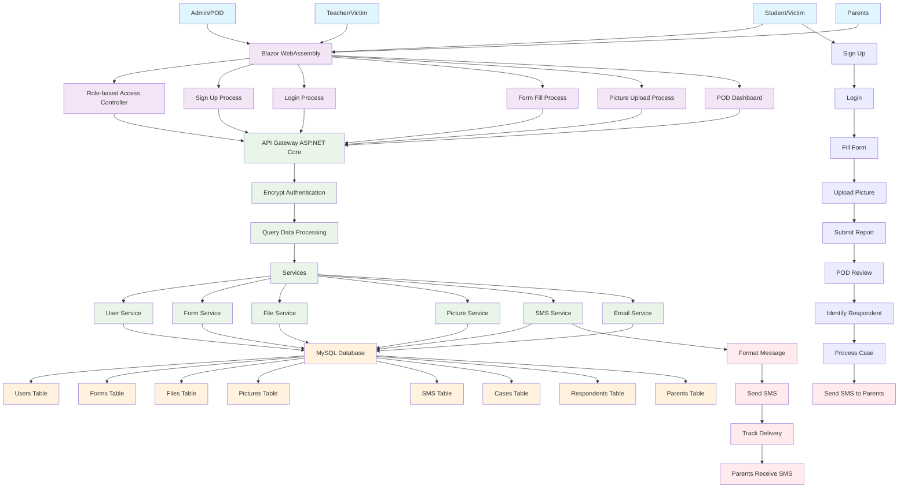
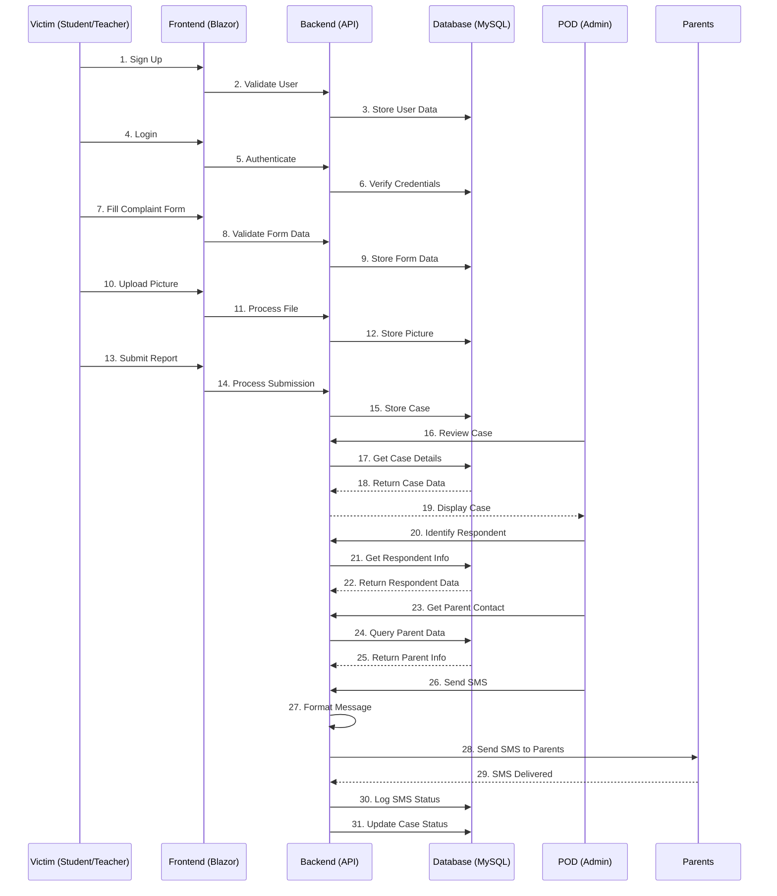

# Gsystem Complete System Design

## Main Architecture Diagram

## Complete Process Flow

## System Features

### Users
- **Admin/POD**: Manages complaints and sends SMS
- **Student/Victim**: Files complaints
- **Teacher/Victim**: Files complaints  
- **Parents**: Receive SMS notifications

### Frontend (Blazor WebAssembly)
- **Sign Up Process**: User registration
- **Login Process**: User authentication
- **Form Fill Process**: Complaint form submission
- **Picture Upload Process**: File upload functionality
- **POD Dashboard**: Admin interface for case management

### Backend (ASP.NET Core)
- **API Gateway**: Routes requests
- **Authentication**: JWT token management
- **Data Processing**: Query and validation
- **Services**: Business logic (User, Form, File, Picture, SMS, Email)

### Database (MySQL)
- **Users Table**: User accounts
- **Forms Table**: Complaint forms
- **Files Table**: Uploaded files
- **Pictures Table**: Image uploads
- **SMS Table**: SMS logs
- **Cases Table**: Complaint cases
- **Respondents Table**: Accused persons
- **Parents Table**: Parent contact info

### SMS Integration
- **Format Message**: Prepare SMS content
- **Send SMS**: Deliver to parents
- **Track Delivery**: Monitor SMS status
- **Parents Receive**: SMS notification

## Complete Flow Summary

1. **Victim** (Student/Teacher) → **Sign Up** → **Login** → **Fill Form** → **Upload Picture** → **Submit Report**
2. **POD** (Admin) → **Review Case** → **Identify Respondent** → **Get Parent Contact** → **Send SMS**
3. **Parents** → **Receive SMS** → **Respond to SMS**
4. **System** → **Log SMS Status** → **Update Case Status**

This is the complete system design with all flows, methods, and SMS integration!
