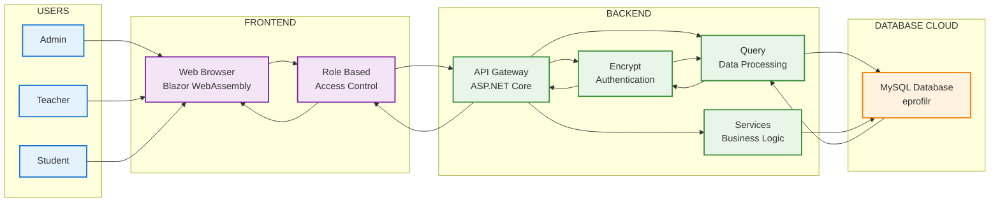

# Gsystem - Simple Architecture Diagram

## Simple System Architecture

## Data Flow:
1. **Users** (Admin, Teacher, Student) access the system
2. **Frontend** (Blazor WebAssembly) handles user interface
3. **API Gateway** receives requests and routes them
4. **Authentication** encrypts and validates user data
5. **Services** process business logic
6. **Database** stores and retrieves data
7. **Response** flows back through the same path

## Key Components:
- **Users**: Admin, Teacher, Student roles
- **Frontend**: Blazor WebAssembly web application
- **Backend**: ASP.NET Core API with authentication
- **Database**: MySQL database for data storage
