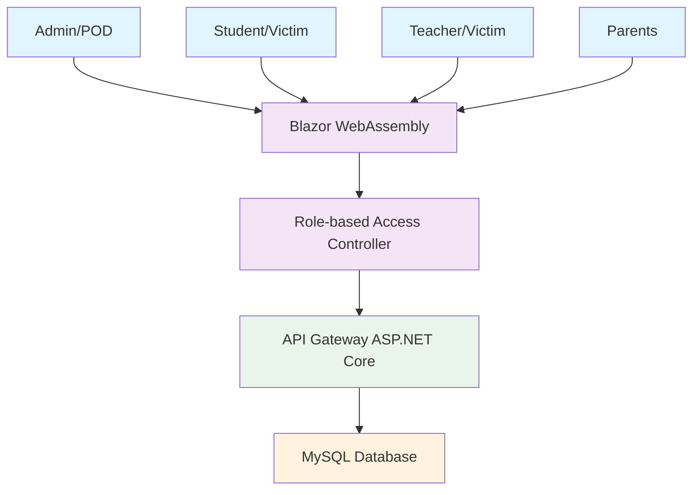

# Test Mermaid Diagram

```mermaid
graph TD
    A[Admin/POD] --> B[Blazor WebAssembly]
    C[Student/Victim] --> B
    D[Teacher/Victim] --> B
    E[Parents] --> B
    
    B --> F[Role-based Access Controller]
    F --> G[API Gateway ASP.NET Core]
    G --> H[MySQL Database]
    
    classDef userClass fill:#e1f5fe
    classDef frontendClass fill:#f3e5f5
    classDef backendClass fill:#e8f5e8
    classDef databaseClass fill:#fff3e0
    
    class A,C,D,E userClass
    class B,F frontendClass
    class G backendClass
    class H databaseClass
```

This is a simple test diagram to see if Mermaid works in your environment.
